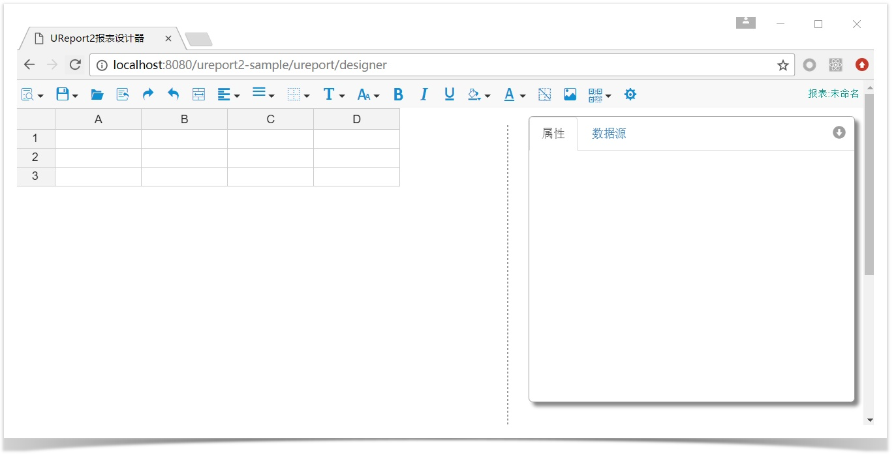
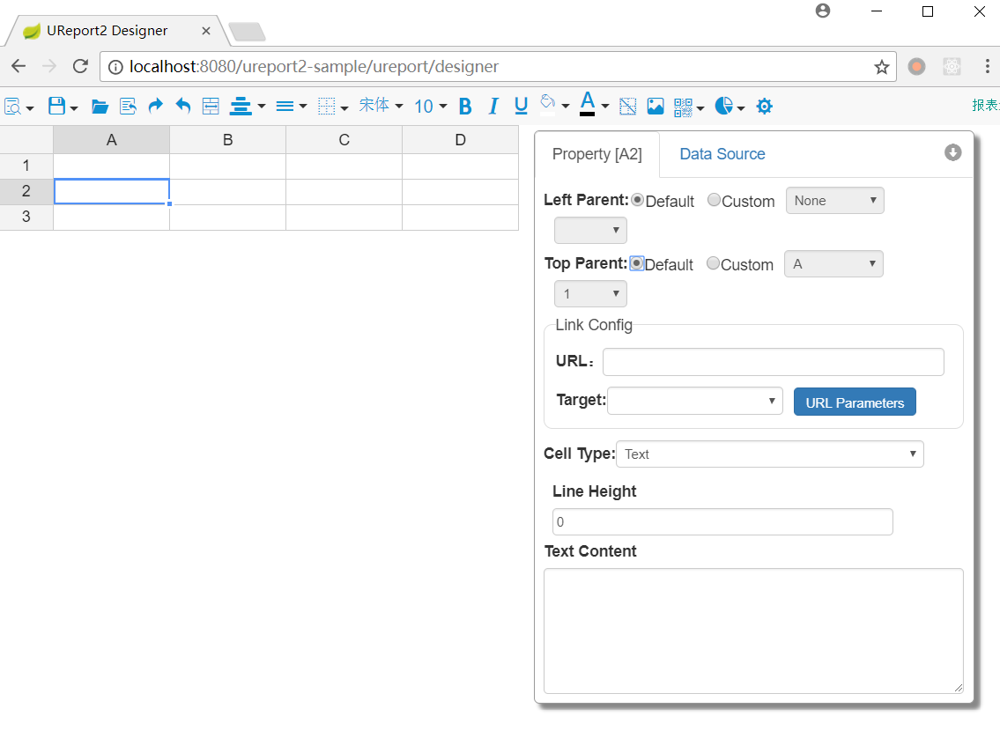

# Overview

UReport2 is a high-performance pure Java report engine based on Spring architecture, where complex Chinese-style statements and reports can be prepared by iteraing over cells.

UReport2 provides the brand new web-based report designer that runs in mainstream browsers including Chrome, Firefox and Edge etc. \(other than IE\). You can complete the design and preparation of complex statements and reports with UReport2 by simply opening the browser.

UReport2 is the first Chinese-style report engine based on Apache-2.0 License.

[中文 README](README-zh_CN.md)

# Teaching video

[http://pan.baidu.com/s/1boWTxF5](http://pan.baidu.com/s/1boWTxF5)，password：98hj

# Installation and Configuration

UReport2 is a pure Java report engine, so it supports all current popular types of J2EE projects. Here we will mainly introduce how Maven-based J2EE projects incorporate UReport2.

### Maven-based UReport2 project

Firstly, we need to create a standard Maven project \(create a project with Eclipse or other tools, while no more details are introduced here\), then open the file pom.xml of Maven, and add the dependence information of UReport2, as shown below:

```
<dependency>
    <groupId>com.bstek.ureport</groupId>
    <artifactId>ureport2-console</artifactId>
    <version>[version]</version>
</dependency>
```

Within the above dependence information, \[version\] indicates the specific version No. of the ureport2-console package. We can search the keyword  “ureport2-c onsole” at [http://search.maven.org/](http://search.maven.org/) to check the specific version No. of the package. The latest source code can be downloaded from [https://github.com/youseries/ureport](https://github.com/youseries/ureport).

It shall be noted that only the latest release version can be found at [http://search.maven.org/](http://search.maven.org/). If you need the latest snapshot, you can search at [https://oss.so](https://oss.so) natype.org/. Pursuant to regulations on sonatype, only the official version can be published on [http://search.maven.org/](http://search.maven.org/), i.e. the central repository of mave, and the snapshot version only exists in [https://oss.sonatype.org/](https://oss.sonatype.org/). If we want to apply the latest snapshot at [https://oss.sonatype.org/](https://oss.sonatype.org/), we need to add repository information in pom.xml, to tell Maven to download the package of snapshot version there. The repository information is listed below:

```
<repository>
    <id>sonatype</id>
    <url>https://oss.sonatype.org/content/groups/public/</url>
</repository>
```

Then, we need to configure the servlet that will be used by UReport2. Open the web.xml file in the project and add the following servlet configuration:

```
<servlet>
    <servlet-name>ureportServlet</servlet-name>
    <servlet-class>com.bstek.ureport.console.UReportServlet</servlet-class>
</servlet>
<servlet-mapping>
    <servlet-name>ureportServlet</servlet-name>
    <url-pattern>/ureport/*</url-pattern>
</servlet-mapping>
```

In the servlet configuratin, the url-pattern shall keep the fixed value of “/ureport/\*” from any change, otherwise the system will fail.

As UReport2 is built based on the framework of spring, the last step of configuration shall be loading the spring configuration file of UReport2 in the project. Several ways are available to load the file, including opening web.xml, adding the listener provided by spring and directly loading the spring configuration file provided by UReport2, as shown below:

```
<listener>
    <listener-class>org.springframework.web.context.ContextLoaderListener</listener-class>
</listener>
<context-param>
    <param-name>contextConfigLocation</param-name>
    <param-value>classpath:ureport-console-context.xml</param-value>
</context-param>
```

If spring is not used in your project, you can apply the above configuration and directly load the spring configuration file provided by UReport2. If spring is used in your project or in other modules of the project, you can import the spring configuration file provided by UReport2 to the existing spring configuration file. The configuration is shown below:

```
<import  resource="classpath:ureport-console-context.xml"  />
```

By now, we have added UReport2 in a standard Maven project. Run the project, and you can see the interface of UReport2 report designer by visiting URL：[http://localhost:8080/\[contextPath\]/ureport/designer](http://localhost:8080/[contextPath]/ureport/designer) in a browser.Links:

* [Reports Storage and Configuration of the Data Source](docs/STORAGE-DATASOURCE.md)
* [The introduction of the report calculation model](docs/REPORT-MODEL.md)
* [Expression](docs/EXPRESSION.md)
* Function
* Condition attribute
* Parameter
* Combinnation with business
* Row type
* Adding blank line and paging
* Load Pictures
* Chromatography printing


